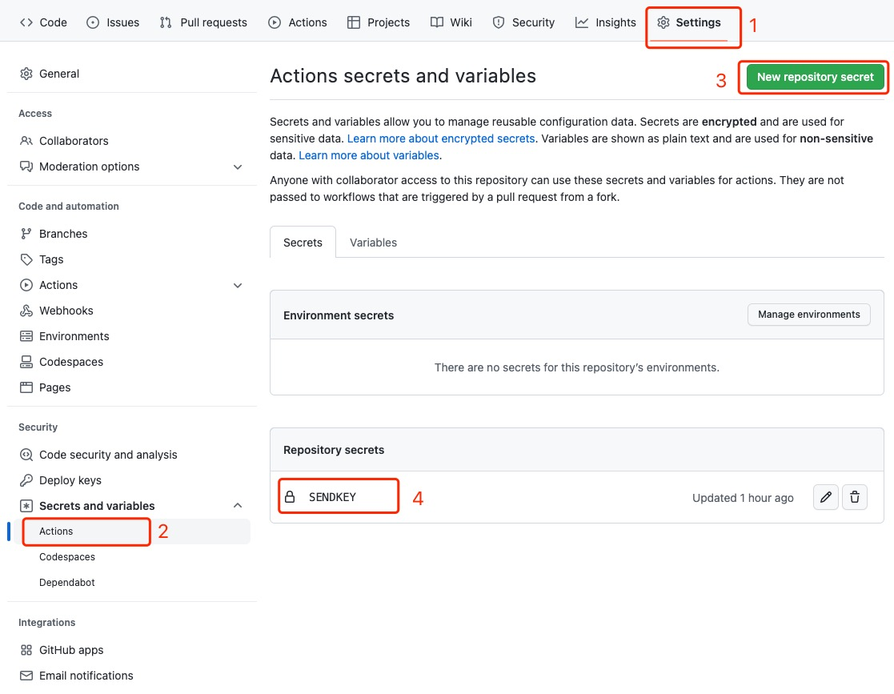

# Server酱微信推送 GitHub Action


## 使用方法

1. 将 sendkey 添加到仓库的 Actions secrets 中，命名为 sendkey 

  

2. 在 workflow 中使用，例子如下：

```yml
- uses: josStorer/get-current-time@v2.0.2
        id: current-time
        with:
          format: YYYYMMDD-HH
          utcOffset: "+08:00"
- uses: easychen/github-action-server-chan@v1
  with:
    sendkey: ${{ secrets.sendkey }}
    title: "server酱Action更新啦 ${{ steps.current-time.outputs.formattedTime }}"
    desp: "可以为空。支持Markdown"
```